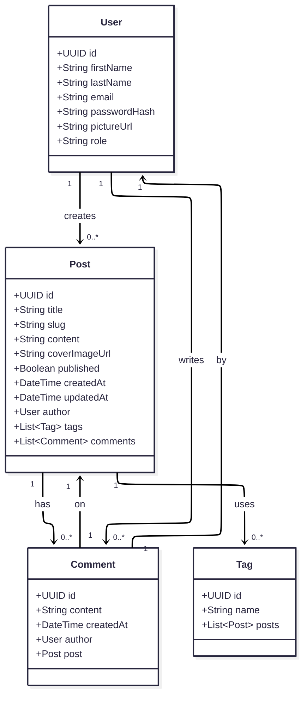

```mermaid
---
config:
  layout: elk
  look: neo
  theme: redux
---
classDiagram
    class User {
        +UUID id
        +String firstName
        +String lastName
        +String email
        +String passwordHash
        +String pictureUrl
        +String role
    }
    class Post {
        +UUID id
        +String title
        +String slug
        +String content
        +String coverImageUrl
        +Boolean published
        +DateTime createdAt
        +DateTime updatedAt
        +User author
        +List~Tag~ tags
        +List~Comment~ comments
    }
    class Comment {
        +UUID id
        +String content
        +DateTime createdAt
        +User author
        +Post post
    }
    class Tag {
        +UUID id
        +String name
        +List~Post~ posts
    }
    User "1" --> "0..*" Post : creates
    User "1" --> "0..*" Comment : writes
    Post "1" --> "0..*" Comment : has
    Post "1" --> "0..*" Tag : uses
    Comment "1" --> "1" User : by
    Comment "1" --> "1" Post : on
w

```

Descrição do projeto em andamento
